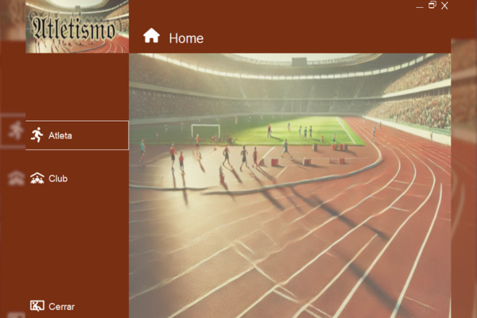

#  Club de Atletismo

## Descripción del Proyecto

**App** es una aplicación de gestión que utiliza una interfaz de usuario desarrollada en **Windows Forms** 
conectada a un backend implementado en **Spring Boot** y 
una base de datos relacional en **MySQL**. 

La aplicación permite a los usuarios iniciar sesión y 
realizar varias acciones administrativas (como la gestión de roles de usuario, registrar y modificar contraseñas). 

La interfaz de usuario y las funcionalidades de administración están diseñadas para ser intuitivas y fáciles de usar.

## Estructura del Proyecto

El proyecto está organizado en tres partes principales:

1. **WindowsFormsApp**: La interfaz gráfica de la aplicación, desarrollada en **Windows Forms**.
2. **SpringBootApp**: El backend de la aplicación, desarrollado en **Spring Boot**, que maneja la lógica de negocio y la conexión con la base de datos.
3. **SQLScripts**: Contiene los scripts necesarios para la creación de la base de datos en **MySQL**.

### 1. **WindowsFormsApp**

Esta carpeta contiene la interfaz gráfica de la aplicación. 
Desarrollada con **Windows Forms**, aquí se implementa la interacción directa del usuario con la aplicación, 
incluyendo los formularios de login, registro, y gestión de contraseñas.

#### Características:

- **Login Admin y Login User**: Formulario para que los usuarios y administradores se autentiquen.
- **Registro de Usuarios**: Permite al administrador registrar a los nuevos usuarios.
- **Modificación de Contraseñas**: El administrador puede modificar las contraseñas.
- **Pendiente de conexión al servidor**: Otras funcionalidades como gestión de eventos, perfil de usuario, y tiendas aún están en desarrollo y no conectadas al backend.

### 2. **SpringBootApp**

Este módulo es el backend de la aplicación, desarrollado en **Spring Boot**. 
Se encarga de manejar las peticiones de la interfaz de usuario y
la lógica de negocio, además de interactuar con la base de datos **MySQL**.

#### Funcionalidades principales:

- **Autenticación y Autorización**: Implementación de JWT para la autenticación de usuarios y administración de roles.
- **Gestión de Usuarios**: CRUD completo para usuarios, incluyendo roles.
- **Seguridad**: Uso de filtros de autorización y autenticación para proteger los endpoints.
- **Documentación con Swagger**: El backend está documentado usando **Swagger** para facilitar el acceso y la prueba de las API.

### 3. **SQLScripts**

Esta carpeta contiene el script SQL para la creación de la base de datos en **MySQL**. 

### 🔍 Endpoints principales

| Método | Endpoint                | Descripción                 |
|--------|-------------------------|-----------------------------|
| GET    | `/usuarios`             | Listar todos los usuarios   |
| GET    | `/usuarios/{id}`        | Obtener usuario por ID      |
| POST   | `/usuarios`             | Crear nuevo usuario         |
| PUT    | `/usuarios/{id}`        | Actualizar usuario por ID   |
| DELETE | `/usuarios/{id}`        | Eliminar usuario por ID     |

---

### 📦 Estructura del proyecto
app-gestion-usuario/
┣ controller/ # Lógica REST
┣ service/ # Lógica de negocio
┣ model/ # Entidades
┣ repository/ # Repositorio JPA
┗ resources/
┗ application.properties

## 📌 Estado del proyecto
Proyecto funcional y ampliable

